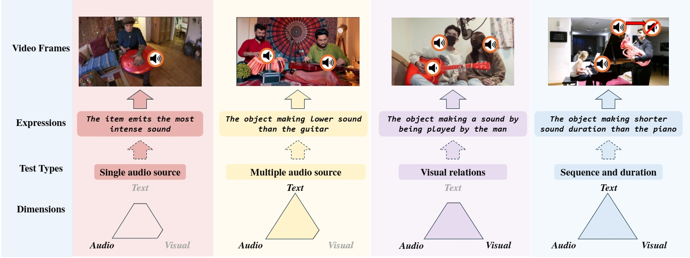
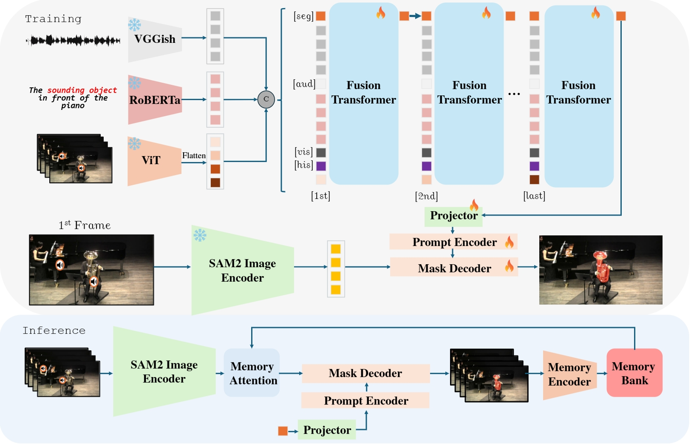

<div align="center">
<h1>  SAM2-LOVE: Segment Anything Model 2 in Language-aided Audio-Visual Scenes </h1>
<div align=center>

</div>
<br>
<a href='https://arxiv.org/abs/2506.01558'></a>


<br>
<div>
<a href="https://sulebai.github.io/">Yuji Wang</a><sup>1,2</sup>,
<a href="" target="_blank">Haoran Xu</a><sup>2</sup>,
<a href="https://yongliu20.github.io/">Yong Liu</a><sup>1</sup>,
<a href="" target="_blank">Jiaze Li</a><sup>2</sup>,
<a href="https://andytang15.github.io/">Yansong Tang</a><sup>1</sup>
</div>
<div>
    <sup>1</sup>Tsinghua University
    <sup>2</sup>ZJU
</div>
</div>

## 📖 Overview
1. We propose a novel framework, SAM2-LOVE that firstly leverages SAM2 to achieve pixel-wise understanding in the LAVS by designing a multimodal fusion module.

2. We develop creative token propagation and accumulation strategies to improve spatio-temporal comprehension of the promtable token.

3. Extensive experiments on Ref-AVS dataset demonstrate the superiority of our method, with ablation studies highlighting the simplicity and effectiveness of its modules.
<div align=center>

</div>


## 🌹 Acknowledgement
Our work is primarily based on [EVF-SAM](https://github.com/hustvl/EVF-SAM?tab=readme-ov-file), [SAM2](https://github.com/facebookresearch/sam2), [Ref-AVS](https://github.com/GeWu-Lab/Ref-AVS). We are sincerely grateful for their excellent works.

## 📚 Citation

If you find our paper and code helpful for your research, please consider starring our repository ⭐ and citing our work ✏️.
```bibtex
@inproceedings{wang2025sam2,
  title={SAM2-LOVE: Segment Anything Model 2 in Language-aided Audio-Visual Scenes},
  author={Wang, Yuji and Xu, Haoran and Liu, Yong and Li, Jiaze and Tang, Yansong},
  booktitle={Proceedings of the Computer Vision and Pattern Recognition Conference},
  pages={28932--28941},
  year={2025}
}
```
